# 本地大模型智能体

基于 Ollama 部署的本地大模型智能体，支持灵活的工具调用能力，可扩展、易配置，适配多种本地大模型。

## 🌟 核心特性

### 智能体能力
- 🤖 **适配 Ollama 生态**：支持 qwen、mistral、llama 等主流本地大模型
- 💬 **交互式对话**：支持多轮对话、历史记录管理、上下文理解
- ⚡ **高效工具调用**：自动解析模型响应并执行对应工具，返回结构化结果
- 🎯 **智能路由**：根据用户请求自动选择合适的工具和API

### 工具系统
- 🔧 **可扩展工具系统**：工具定义与实现分离，轻松新增自定义工具
- 📦 **丰富的工具库**：内置基础工具、HTTP请求、日志分析、终端操作等多种工具
- 🔌 **插件化架构**：支持动态加载工具，无需重启服务
- 📋 **API列表管理**：限制模型只能使用预定义的API列表，确保安全可控

### Web服务
- 🌐 **HTTP请求工具**：支持发送GET、POST等HTTP请求到指定API接口
- 🖥️ **WebSSH终端**：基于WebSocket的SSH终端，支持远程服务器管理
- 🔄 **反向代理**：统一入口代理多个后端服务，简化访问配置
- 🎨 **现代化界面**：响应式设计，支持多种终端访问方式

### 日志分析
- 🔍 **日志分析功能**：分析GeoServer日志文件，识别潜在威胁和异常内容
- 🛡️ **安全检测**：支持SQL注入、XSS、命令注入等多种攻击模式检测
- 📊 **威胁报告**：提供详细的威胁分析和统计报告

### 部署运维
- 🚀 **一键启动**：支持一键启动所有服务，方便部署和管理
- ⚙️ **可配置化**：通过配置文件灵活调整模型参数、工具路径等
- 📊 **健康检查**：提供服务健康检查接口，便于监控
- 📝 **详细日志**：完整的日志记录，便于问题排查和审计

### 技术特性
- 🌊 **异步架构**：基于aiohttp和Tornado的异步处理，提高并发性能
- 🔐 **安全认证**：Token机制管理SSH连接，确保安全性
- 🎯 **精确控制**：支持终端命令的精确控制和执行
- 🔄 **热重载**：支持工具的热加载，无需重启服务

## 📋 目录结构
```
Agent/
├── tools/                      # 工具模块
│   ├── definitions/            # 工具定义（JSON格式，描述工具元信息）
│   │   ├── base_tools.json     # 基础工具（时间、网络）
│   │   ├── http_tools.json     # HTTP请求工具
│   │   ├── log_analysis_tools.json  # 日志分析工具
│   │   ├── terminal_tools.json # 终端工具
│   │   └── test_tools.json     # 测试工具
│   │
│   └── implementations/        # 工具实现（Python类，对应具体逻辑）
│       ├── __init__.py
│       ├── base_tools.py       # 基础工具实现（获取时间、网络搜索）
│       ├── http_tools.py       # HTTP请求工具实现（发送HTTP请求）
│       ├── log_analysis_tools.py  # 日志分析工具实现
│       ├── log_decorator.py    # 日志装饰器
│       ├── math_tools.py       # 数学工具实现（计算、问候）
│       ├── system_tools.py     # 系统工具
│       └── terminal_tools.py   # 终端工具实现
│
├── static/                     # 静态文件目录
│   ├── chat/                   # 聊天界面前端
│   │   ├── css/
│   │   │   └── index.css
│   │   ├── js/
│   │   │   ├── Message.js
│   │   │   └── index.js
│   │   └── index.html
│   ├── shell/                  # SSH终端前端
│   │   ├── css/
│   │   │   └── xterm.min.css
│   │   ├── lib/
│   │   │   ├── xterm-addon-fit.min.js
│   │   │   └── xterm.min.js
│   │   └── WebSHell.html
│   └── common/                 # 通用前端资源
│       └── base.js
│
├── utils/                      # 工具模块
│   ├── src/                    # 工具源码
│   │   └── token_utils.py      # Token工具（SSH连接token管理）
│   └── bin/                    # 二进制工具
│       └── balcon/             # Balcon语音合成工具
│           ├── balcon.exe
│           ├── chsdet.dll
│           └── lame.exe
│
├── log/                        # 日志目录
│   ├── global_debug.log        # 全局调试日志
│   ├── chat_2026-02-18.log     # 聊天日志
│   └── chat_requests.log       # 聊天请求日志
│
├── test/                       # 测试目录
│   ├── config.py
│   ├── test_log.py
│   ├── demo1.py
│   ├── d2.py
│   ├── d3.py
│   └── geoserver.log.1         # 示例日志文件
│
├── abandon/                    # 已弃用的程序(不参与程序)
│   └── voice_tools.py          # 旧版语音工具实现
│
├── prompts/                    # 提示词目录
│   ├── system_prompt.json      # 系统提示词（JSON格式）
│   └── system_prompt.yaml      # 系统提示词（YAML格式）
│
├── .vscode/                    # VSCode配置
│   ├── launch.json
│   └── settings.json
│
├── api_config.json             # API列表配置（限制模型可使用的API）
├── base_init.py                # 基础初始化模块
├── config.py                   # 核心配置（模型、API、工具路径）
├── tool_registry.py            # 工具注册表（加载/管理工具定义与实现）
├── agent_core.py               # 智能体核心（对话、工具调用、模型交互）
├── main.py                     # 程序入口（交互/单次查询模式）
├── web_server.py               # Web服务器（Flask，端口28080）
├── WebSHell.py                 # SSH终端服务（Tornado WebSocket，端口28081）
├── proxy_server.py             # 反向代理服务器（aiohttp，端口8080）
├── start_all.py                # 一键启动脚本（Python）
├── start_all.bat               # 一键启动脚本（Windows批处理）
├── requirements.txt            # 依赖清单
├── CHANGELOG.md                # 变更日志
├── Function.log                # 使用日志
├── Tree.md                     # 目录树
├── README.md                   # 项目说明
└── test.md                     # 测试文档
```

## 🏗️ 系统架构

### 整体架构图

```mermaid
flowchart TB
    subgraph 用户访问层
        A1[Web浏览器\nhttp://localhost:8080]
        A2[命令行终端\npython main.py]
    end

    subgraph 反向代理层
        B1[反向代理服务\nproxy_server.py:8080\naiohttp]
    end

    subgraph 应用服务层
        C1[Flask聊天服务\nweb_server.py:28080]
        C2[Tornado SSH服务\nWebSHell.py:28081]
    end

    subgraph 智能体核心层
        D1[AgentCore\nagent_core.py]
        D2[ToolRegistry\ntool_registry.py]
        D3[对话管理\nConversation History]
    end

    subgraph 工具执行层
        E1[基础工具\nbase_tools.py]
        E2[HTTP请求工具\nhttp_tools.py]
        E3[日志分析工具\nlog_analysis_tools.py]
        E4[终端工具\nterminal_tools.py]
        E5[数学工具\nmath_tools.py]
    end

    subgraph AI模型层
        F1[Ollama API\nhttp://localhost:11434]
        F2[本地大模型\nqwen3:8b/14b]
    end

    subgraph 外部服务层
        G1[外部API服务]
        G2[SSH服务器]
        G3[日志文件]
    end

    subgraph 配置层
        H1[config.py\n核心配置]
        H2[system_prompt.yaml\n系统提示词]
        H3[api_config.json\nAPI列表]
    end

    A1 --> B1
    A2 --> D1
    B1 --> C1
    B1 --> C2
    C1 --> D1
    C2 --> E4
    D1 --> D2
    D1 --> D3
    D1 --> F1
    D2 --> E1
    D2 --> E2
    D2 --> E3
    D2 --> E4
    D2 --> E5
    F1 --> F2
    E2 --> G1
    E4 --> G2
    E3 --> G3
    H1 --> D1
    H1 --> D2
    H2 --> D1
    H3 --> E2

    style A1 fill:#e1f5ff,stroke:#01579b,stroke-width:2px
    style B1 fill:#fff3e0,stroke:#e65100,stroke-width:2px
    style D1 fill:#f3e5f5,stroke:#4a148c,stroke-width:2px
    style F1 fill:#e8f5e9,stroke:#1b5e20,stroke-width:2px
    style H1 fill:#fce4ec,stroke:#880e4f,stroke-width:2px
```



### 技术栈

| 层级 | 技术 | 说明 |
|------|------|------|
| **前端** | HTML5/CSS3/JavaScript | Web聊天界面和SSH终端界面 |
| **前端框架** | xterm.js | 终端模拟器库，提供完整的终端体验 |
| **反向代理** | aiohttp | 异步HTTP服务器/客户端，提供反向代理功能 |
| **Web服务** | Flask | 轻量级Python Web框架，提供聊天API服务 |
| **WebSocket** | Tornado | 异步Web框架，提供WebSocket SSH连接 |
| **SSH连接** | paramiko | Python SSHv2协议库，用于SSH连接管理 |
| **AI模型** | Ollama | 本地大模型运行时，支持多种模型 |
| **配置管理** | YAML/JSON | 配置文件格式，灵活管理配置 |
| **日志** | Python logging | 标准日志模块，记录系统运行状态 |
| **依赖管理** | pip/requirements.txt | Python包管理工具 |

### 核心组件说明

#### 1. 反向代理服务（proxy_server.py）
- **端口**：8080
- **技术**：aiohttp
- **功能**：
  - 统一入口，代理所有后端服务
  - 静态文件服务（聊天界面、SSH终端界面）
  - WebSocket代理（SSH终端连接）
  - API请求转发
- **路由配置**：
  - `/` → 聊天界面（static/chat/index.html）
  - `/shell/` → SSH终端界面（static/shell/WebSHell.html）
  - `/api/*` → Flask聊天服务（28080端口）
  - `/shell/ws/*` → Tornado SSH服务（28081端口，WebSocket）
  - `/shell/api/*` → Tornado SSH服务（28081端口，API）

#### 2. Flask聊天服务（web_server.py）
- **端口**：28080
- **技术**：Flask + Flask-CORS
- **功能**：
  - 提供聊天API接口（/api/chat）
  - 处理用户消息，调用AgentCore
  - 返回AI响应和终端命令
  - 健康检查接口（/api/health）
  - 工具列表查询（/api/tools）
- **核心路由**：
  - `GET /` - 聊天界面
  - `POST /api/chat` - 聊天API
  - `GET /api/tools` - 获取工具列表
  - `GET /api/health` - 健康检查

#### 3. Tornado SSH服务（WebSHell.py）
- **端口**：28081
- **技术**：Tornado + paramiko
- **功能**：
  - 提供WebSocket SSH连接
  - 管理SSH连接会话
  - 支持终端尺寸自适应
  - Token状态管理
- **核心路由**：
  - `WS /ws` - WebSocket SSH连接
  - `GET/POST /api/token/status` - Token状态查询

#### 4. AgentCore（agent_core.py）
- **功能**：
  - 处理用户消息
  - 管理对话历史
  - 调用Ollama模型
  - 解析工具调用
  - 执行工具并返回结果
- **核心方法**：
  - `process_message()` - 处理用户消息
  - `_call_ollama()` - 调用Ollama API
  - `_extract_tool_call()` - 提取工具调用

#### 5. ToolRegistry（tool_registry.py）
- **功能**：
  - 加载工具定义（JSON格式）
  - 加载工具实现（Python类）
  - 管理工具注册表
  - 执行工具调用
- **工具定义目录**：`tools/definitions/*.json`
- **工具实现目录**：`tools/implementations/*.py`

### 数据流

#### 聊天流程


#### SSH终端流程


### 部署架构

#### 开发环境部署

```
┌─────────────────────────────────────────────────────────────┐
│                        本地开发环境                            │
├─────────────────────────────────────────────────────────────┤
│  ┌─────────────┐  ┌─────────────┐  ┌─────────────┐          │
│  │  浏览器     │  │  命令行     │  │  Ollama     │          │
│  │  (前端)     │  │  (CLI)      │  │  (AI模型)   │          │
│  └──────┬──────┘  └──────┬──────┘  └──────┬──────┘          │
│         │                │                │                  │
│         │                │                │                  │
│  ┌──────▼────────────────▼────────────────▼──────┐          │
│  │           反向代理服务 (8080)                   │          │
│  │              aiohttp                           │          │
│  └──────┬─────────────────────────────────────────┘          │
│         │                                                │
│         ├──────────────┬──────────────┐                 │
│         │              │              │                 │
│  ┌──────▼──────┐ ┌─────▼──────┐ ┌───▼────────┐          │
│  │ Flask服务   │ │ Tornado服务│ │ 静态文件    │          │
│  │  (28080)    │ │  (28081)   │ │  (前端)     │          │
│  └──────┬──────┘ └─────┬──────┘ └────────────┘          │
│         │              │                                  │
│         │              │                                  │
│  ┌──────▼──────────────▼──────┐                          │
│  │      AgentCore + 工具系统   │                          │
│  └───────────────────────────┘                          │
└─────────────────────────────────────────────────────────────┘
```

#### 生产环境部署建议


**生产环境部署建议：**
1. **负载均衡**：使用Nginx或Caddy作为反向代理和负载均衡器
2. **容器化**：使用Docker容器化部署，便于管理和扩展
3. **服务发现**：使用Consul或Etcd进行服务发现
4. **监控告警**：使用Prometheus + Grafana监控系统状态
5. **日志收集**：使用ELK（Elasticsearch + Logstash + Kibana）收集日志
6. **高可用**：部署多实例，确保服务高可用
7. **安全加固**：配置HTTPS、防火墙、访问控制等安全措施

### 配置管理

#### 核心配置文件

| 配置文件 | 说明 | 主要配置项 |
|----------|------|------------|
| `config.py` | 核心配置 | Ollama API地址、模型名称、工具路径、模型参数 |
| `system_prompt.yaml` | 系统提示词 | 工具调用规则、可用工具列表、API列表 |
| `api_config.json` | API配置 | 允许使用的API列表、API参数定义 |
| `start_all.py` | 启动脚本 | 服务配置、端口配置、启动顺序 |

#### 环境变量（可选）

```bash
# Ollama配置
OLLAMA_API_BASE=http://localhost:11434/api
MODEL_NAME=qwen3:8b

# 服务端口配置
PROXY_PORT=8080
FLASK_PORT=28080
TORNADO_PORT=28081

# 后端API配置
BACKEND_API_BASE=http://127.0.0.1:8002

# 日志配置
LOG_LEVEL=INFO
```

## 🛠️ 环境要求
- Python 3.8+
- Ollama（已安装并运行，参考 [Ollama 官网](https://ollama.com/)）
- 本地模型（如 qwen3:8b、qwen3:14b、mistral:7b 等，需提前通过 `ollama pull` 下载）
- SSH服务器（如需使用WebSSH功能）

## 🚀 安装步骤

### 1. 安装 Ollama
```bash
# 方式1：官网脚本（推荐）
curl -fsSL https://ollama.com/install.sh | sh

# 方式2：手动下载（根据系统选择，参考官网）
# https://ollama.com/download
```

### 2. 启动 Ollama 服务
```bash
ollama serve  # 后台运行
# 或直接启动（前台）：ollama run qwen3:14b
```

### 3. 下载本地模型
```bash
# 推荐使用 qwen3:8b（默认配置）
ollama pull qwen3:8b

# 或使用更大的模型
ollama pull qwen3:14b
```

### 4. 克隆/下载项目代码
```bash
git clone https://github.com/SuperCatPlus/My-first-agent.git
cd My-first-agent
```

### 5. 安装 Python 依赖
```bash
pip install -r requirements.txt

# 核心依赖包括：
# - requests: HTTP请求
# - pyyaml: YAML配置文件解析
# - pytz: 时区处理
# - flask: Web服务器
# - flask-cors: 跨域支持
# - tornado: WebSocket服务
# - paramiko: SSH连接
# - aiohttp: 异步HTTP服务
```

## 📖 使用指南

### 1. 一键启动所有服务（推荐）

**Windows系统**：
```bash
# 方式1：使用批处理脚本
start_all.bat

# 方式2：使用Python脚本
python start_all.py
```

**Linux/Mac系统**：
```bash
python start_all.py
```

**启动后可访问**：
- 主界面：http://localhost:8080
- 聊天界面：http://localhost:8080/
- SSH终端：http://localhost:8080/shell/
- 健康检查：http://localhost:8080/api/health

**一键启动特点**：
- 自动启动所有服务（聊天服务、SSH终端服务、反向代理服务）
- 自动检查端口占用情况
- 自动检查依赖包
- 支持优雅停止（Ctrl+C）

### 2. 单独启动服务

**启动Web聊天服务**：
```bash
python web_server.py
# 访问：http://localhost:28080
```

**启动SSH终端服务**：
```bash
python WebSHell.py
# 访问：http://localhost:28081/shell/
```

**启动反向代理服务**：
```bash
python proxy_server.py
# 访问：http://localhost:8080
```

### 3. Web界面使用

**Web聊天界面特点**：
- 现代化聊天界面，支持消息历史记录
- 实时显示可用工具列表
- 响应式设计，适配不同屏幕尺寸
- 支持按Enter键发送消息（Shift+Enter换行）
- 自动显示模型状态和工具调用结果

**WebSSH终端特点**：
- 基于WebSocket的SSH终端
- 支持终端尺寸自适应
- 支持颜色显示
- 支持复制粘贴

### 4. 命令行使用（交互模式）
```bash
# 启动交互式对话（默认使用 config.py 中配置的模型）
python main.py

# 指定模型启动
python main.py --model qwen3:8b
```

交互指令：
- 输入问题直接对话（如「现在几点了？」「计算 2+3*4」）
- 输入 `清除`/`clear`：清空对话历史
- 输入 `退出`/`quit`：退出程序

### 5. 单次查询模式
```bash
# 直接执行单次查询
python main.py --query "现在的北京时间是多少？"

# 指定模型+单次查询
python main.py --model qwen3:8b --query "计算 100*2 + 50/2"
```

### 6. 查看可用工具
```bash
python main.py --list-tools
```

### 7. HTTP请求工具使用
智能体支持发送HTTP请求到指定的API接口：

**调用格式**：
```
TOOL_CALL: http_request {
  "url": "http://localhost:8000/api/Alarm",
  "method": "GET",
  "timeout": 10
}
```

**示例**：
- 获取报警信息：`python main.py --query "获取报警信息"`
- 更新报警值：`python main.py --query "更新报警值为20"`

### 9. 日志分析功能使用
智能体支持分析GeoServer日志文件，识别潜在威胁和异常内容：

**工具名称**：
- `analyze_geoserver_log`：分析GeoServer日志文件，返回详细分析结果
- `analyze_geoserver_log_summarize`：分析GeoServer日志文件，返回威胁摘要

**调用格式**：
```
TOOL_CALL: analyze_geoserver_log {
  "log_file_path": "geoserver.log.1"
}
```

**参数说明**：
- `log_file_path` (可选)：日志文件路径，默认使用geoserver.log.1

**示例**：
- 分析默认日志文件：`python main.py --query "分析GeoServer日志，检查是否有威胁"`
- 分析指定日志文件：`python main.py --query "分析/var/log/geoserver.log文件"`
- 获取威胁摘要：`python main.py --query "获取GeoServer日志威胁摘要"`

**日志分析功能**：
系统会自动分析日志中的威胁，包括：
- SQL注入攻击
- XSS攻击
- 敏感文件访问
- 命令注入
- 路径遍历
- 异常请求
- 其他潜在威胁

### 10. WebSSH终端使用
智能体提供基于WebSocket的SSH终端功能：

**访问方式**：
1. 启动所有服务：`python start_all.py`
2. 在浏览器中打开 `http://localhost:8080/shell/`
3. 输入SSH连接信息（主机、端口、用户名、密码）
4. 点击连接按钮，建立SSH连接

**WebSSH特点**：
- 基于WebSocket的实时终端
- 支持终端尺寸自适应
- 支持颜色显示
- 支持复制粘贴
- 支持多个并发连接

### 11. API列表管理
智能体只能使用预定义的API列表，确保安全可控：

**配置文件**：`api_config.json`
- 存储允许使用的API列表
- 包含API的URL、方法、描述和参数信息

**使用限制**：
- 模型只能使用`api_config.json`中定义的API
- 严格按照配置的参数格式调用API
- 支持GET和POST等多种HTTP方法

**预定义API**：
- Alarm：获取报警信息
- AlarmU：更新报警信息
- LogLastLines：获取日志最后几行

## ⚙️ 配置说明
核心配置文件：`config.py`

| 配置项 | 说明 | 默认值 |
|--------|------|--------|
| `OLLAMA_API_BASE` | Ollama API 地址 | `http://localhost:11434/api` |
| `MODEL_NAME` | 默认使用的模型 | `qwen3:8b` |
| `TOOLS_DEFINITIONS_DIR` | 工具定义目录 | `tools/definitions` |
| `TOOLS_IMPLEMENTATIONS_DIR` | 工具实现目录 | `tools/implementations` |
| `SYSTEM_PROMPT_FILE` | 系统提示词文件 | `prompts/system_prompt.yaml` |
| `BACKEND_API_BASE` | 后端API地址 | `http://127.0.0.1:8002` |
| `DEFAULT_LOG_FILE_PATH` | 默认日志文件路径 | `geoserver.log.1` |
| `MODEL_PARAMS` | 模型参数（温度、最大令牌等） | `temperature:0.7, top_p:0.9, max_tokens:1000` |

**服务端口配置**：
| 服务 | 端口 | 说明 |
|------|------|------|
| 反向代理服务 | 8080 | 统一入口，代理所有后端服务（aiohttp） |
| Flask聊天服务 | 28080 | 提供聊天API接口（Flask） |
| Tornado SSH服务 | 28081 | 提供WebSocket SSH连接（Tornado） |

## 🔌 扩展自定义工具
### 步骤1：定义工具（JSON）
在 `tools/definitions/` 下新建 `custom_tools.json`：
```json
{
    "tools": [
        {
            "name": "get_weather",
            "description": "获取指定城市的天气",
            "parameters": {
                "type": "object",
                "properties": {
                    "city": {
                        "type": "string",
                        "description": "城市名称，如北京、上海"
                    }
                },
                "required": ["city"]
            }
        }
    ]
}
```

### 步骤2：实现工具（Python）
在 `tools/implementations/` 下新建 `custom_tools.py`：
```python
from typing import Dict, Any
import requests

class CustomTools:
    """自定义工具实现类"""
    
    @staticmethod
    def get_weather(city: str) -> Dict[str, Any]:
        """获取指定城市天气"""
        try:
            # 示例：调用天气API（需替换为真实接口）
            url = f"https://api.example.com/weather?city={city}"
            response = requests.get(url, timeout=5)
            data = response.json()
            
            return {
                "city": city,
                "weather": data.get("weather"),
                "temperature": data.get("temp"),
                "success": True
            }
        except Exception as e:
            return {
                "city": city,
                "error": f"获取天气失败: {str(e)}",
                "success": False
            }
```

### 步骤3：注册工具
修改 `tools/implementations/__init__.py`，添加自定义工具类：
```python
from .base_tools import BaseTools
from .math_tools import MathTools
from .custom_tools import CustomTools  # 新增
__all__ = ['BaseTools', 'MathTools', 'CustomTools']
```

### 步骤4：更新系统提示词
在 `prompts/system_prompt.yaml` 或 `prompts/system_prompt.json` 中添加新工具和API的说明，确保模型能识别并正确使用。

### 步骤5：扩展API列表（可选）
如果需要限制模型只能使用特定的API，可在 `api_config.json` 中添加：
```json
{
    "allowed_apis": [
        {
            "name": "Weather",
            "url": "https://api.example.com/weather",
            "method": "GET",
            "description": "获取天气信息",
            "params": {
                "city": {
                    "type": "string",
                    "required": true,
                    "description": "城市名称"
                }
            }
        }
    ]
```

## 📝 常见问题
### Q1: 连接 Ollama 失败？
- 检查 Ollama 服务是否启动：`ollama serve`
- 确认 API 地址正确：默认 `http://localhost:11434`
- 防火墙/代理是否拦截本地请求

### Q2: 工具调用无响应？
- 检查工具名称是否与定义/实现一致（大小写敏感）
- 查看控制台输出，确认工具是否成功加载
- 检查系统提示词中工具调用格式是否正确

### Q3: 模型响应慢？
- 降低模型规模（如从 14B 换为 8B）
- 调整 `MODEL_PARAMS` 中的 `max_tokens` 减小响应长度
- 确保本地硬件满足模型运行要求（如足够的内存/显存）

### Q4: WebSSH无法连接？
- 确认SSH服务已启动：`python start_all.py`
- 检查端口28081是否被占用
- 确认目标SSH服务器可访问
- 检查SSH连接信息（主机、端口、用户名、密码）是否正确

### Q5: 反向代理无法访问？
- 确认反向代理服务已启动：`python start_all.py`
- 检查端口8080是否被占用
- 确认后端服务（聊天服务、SSH服务）已启动
- 检查浏览器控制台是否有错误信息
- 确认前端文件目录路径配置正确（proxy_server.py中的FRONTEND_CONFIGS）

### Q6: 日志分析工具报错？
- 确认日志文件路径正确
- 检查日志文件是否存在且有读取权限
- 确认日志文件格式为GeoServer日志格式
- 查看控制台输出，获取详细错误信息

## 📄 许可证
你不会真以为我有开源许可证把🤤

## 📧 反馈与贡献
搞完就不更了

## 📚 变更日志
详细的变更记录请查看 [CHANGELOG.md](file:///g:/phpstudy_pro/.jqgh/NewInformationTechnology/Agent/CHANGELOG.md)

---

### 更新说明

#### 最新更新（v1.3.4）
1. **架构优化**：
   - 采用分层架构设计，提高可扩展性和可维护性
   - 支持多种前端访问方式（Web聊天、WebSSH、命令行）
   - 支持多种后端服务（Flask、Tornado、aiohttp）
   - 完善的反向代理机制，统一入口管理

2. **新增功能**：
   - WebSSH终端：支持基于WebSocket的SSH连接，Token认证机制
   - 反向代理服务：统一入口代理多个后端服务（端口8080）
   - 一键启动脚本：方便快速启动所有服务（start_all.py/start_all.bat）
   - 日志分析工具：分析GeoServer日志，识别潜在威胁和异常内容
   - Token管理系统：SSH连接Token的生成、验证、失效管理

3. **技术栈更新**：
   - 反向代理：使用aiohttp实现高性能异步代理
   - SSH服务：使用Tornado + paramiko实现WebSocket SSH连接
   - 前端终端：集成xterm.js提供完整的终端体验
   - 工具系统：支持同步和异步工具的统一管理

4. **配置更新**：
   - 默认模型：qwen3:8b（平衡性能和效果）
   - 服务端口配置：
     - 反向代理服务：8080
     - Flask聊天服务：28080
     - Tornado SSH服务：28081
   - 新增utils目录：包含token_utils.py和balcon语音工具

5. **文档完善**：
   - 更新目录结构，反映最新项目结构
   - 新增详细的系统架构图和数据流图
   - 新增技术栈说明和部署架构建议
   - 新增WebSSH使用说明和Token管理说明
   - 新增日志分析工具使用说明
   - 更新常见问题解答
   - 新增配置管理和环境变量说明

6. **已知问题**：
   - Token校验代码残留问题：部分token校验代码未完全清理，可能导致"终端未连接"错误提示
   - 详细说明请参考 [CHANGELOG.md](file:///g:/phpstudy_pro/.jqgh/NewInformationTechnology/Agent/CHANGELOG.md)

